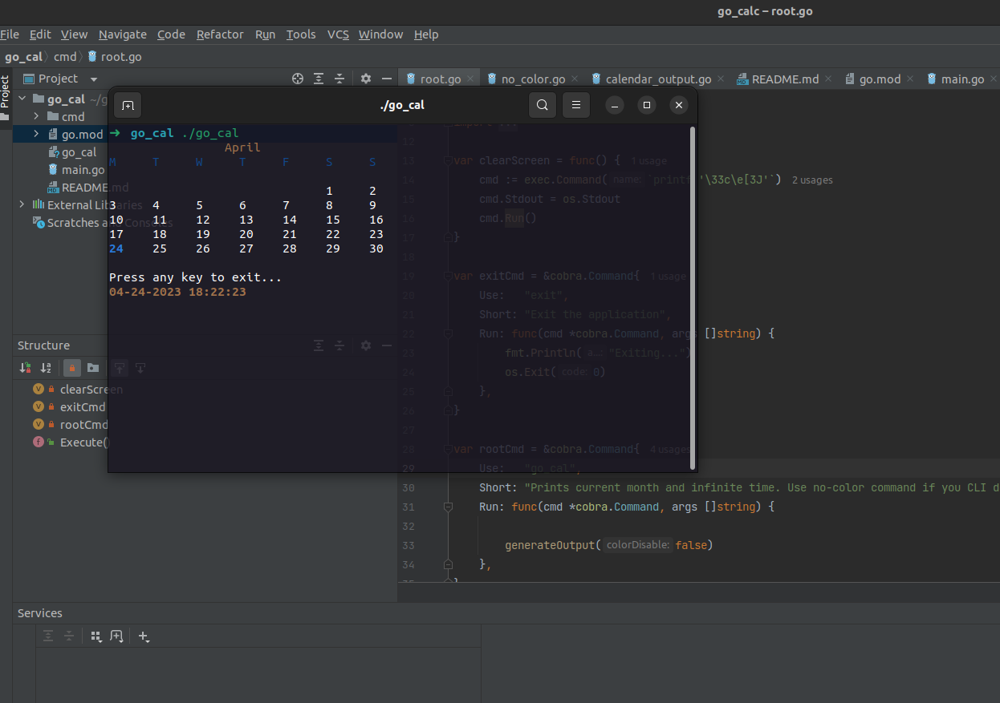

## Simple Go calendar and infinite watch

### Description

My first go program. Just for fun. But might be usefully for systems without GNU

### Usage
Run calendar
```bash
./go_cal 
```
Run calendar without colors
```bash
./go_cal no-color
```


